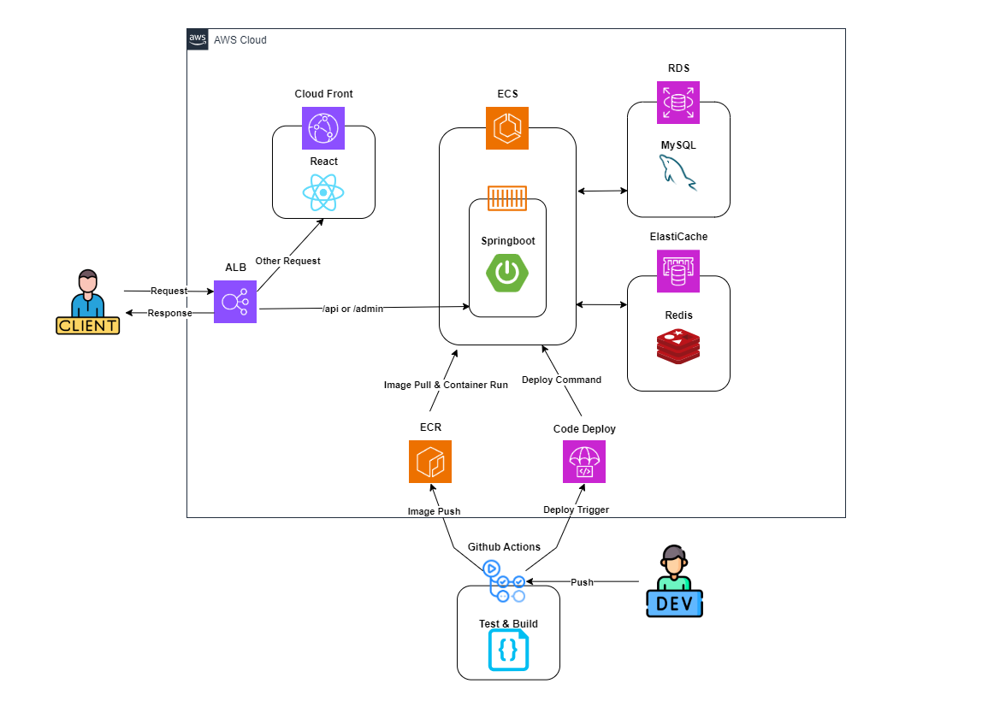

# [숨겨진 화백]

예술 문화 가치 증진과 교육 불평등 해소를 위한 유저맞춤형 초기작가, 작품 큐레이션 및 멘토링 중개 서비스

```text
숨겨진 작가와 작품이 빛을 발하는 그날까지
```

- [🎯서비스 배경 및 목표](#-서비스-배경-및-목표)
- [👥 팀 구성](#-팀-구성)
- [📀 아키텍처](#-아키텍처)
- [🗃️ ERD](#-erd)
- [📂 패키지 구조](#-패키지-구조)
- [🚀 기술적 경험](#-기술적-경험)

---

## 🎯 서비스 배경 및 목표

홍보성과 정보 접근성이 부족한 초기 작가와 작품들을 대중들에게 소개함으로써 예술의 대중화 및 문화가치 증진을 주 목적으로합니다.
<br/>
최종적으로 대중들의 문화 수준을 향상시키고, 예술 교육 격차를 해소함으로써 사회의 지속가능한 발전을 목표로 합니다.

## 👥 팀 구성

- 오한영: 프로젝트 관리 및 어드민페이지 개발
- 김기홍: 백엔드 API 개발 및 로컬 테스트환경, CI/CD 파이프라인 구축
- 김현주: React 기반 프론트엔드 UI/UX 개발

## 🛠️ 기술 스택

| 분류       | 기술 명                                                                                  |
|----------|---------------------------------------------------------------------------------------|
| FrontEnd | JavaScript, axios, React, Figma                                                       |
| BackEnd  | Java 17, Spring(Boot 3.3.2, Security, JPA), QueryDsl, JUnit, Test Containers, Mockito |
| DataBase | MySQL 8, Redis                                                                        |
| DevOps   | Docker, NGINX, (AWS) ECS, ECR, RDS, ELB, CodeDeploy, GithubActions                    |
| Tools    | IntelliJ, WebStorm, nGrinder, Notion, Slack                                           |

## 📀 아키텍처



## 🗃️ ERD

- 추가예정

## 📂 패키지 구조

```text
HiddenArtist
    ├─.github
    │    ├─workflows
    │    └─ISSUE_TEMPLATE
    │
    ├─docker
    │    └─docker-compose.yml
    │
    ├─frontend
    │     ├─dist/...
    │     ├─public/...
    │     └─src
    │        └─components/...
    │
    ├─backend
    │    └─src
    │       ├─main/java/com/hiddenartist/backend
    │       │             ├─domain
    │       │             │    └─api
    │       │             │       ├─controller
    │       │             │       │     ├─request
    │       │             │       │     └─response
    │       │             │       ├─persistence
    │       │             │       │     ├─entity...
    │       │             │       │     ├─type
    │       │             │       │     └─repository
    │       │             │       └─service
    │       │             │
    │       │             └─global
    │       │                 ├─config
    │       │                 ├─exception
    │       │                 ├─security
    │       │                 ├─redis
    │       │                 ├─aop
    │       │                 ├─utils
    │       │                 └─ ...
    │       └─test/...
    └─README.md
```

## 🚀 기술적 경험

### 1. Docker Compose를 사용한 로컬 테스트환경 구축

[[구성 디렉토리](https://github.com/Team-ToArt/HiddenArtist-Service/tree/main/docker)/[설정 코드](https://github.com/Team-ToArt/HiddenArtist-Service/blob/531597a4441fd32778bee1167cef94c6c671c481/docker/docker-compose.front.yml#L1-L27)]

- 목표: 프론트엔드 개발자가 JDK를 설치하지 않아도 실제 API 요청을 테스트할 수 있도록 `Docker Compose`환경 구축
- 구성: `NGINX`,`Springboot`, `MySQL`,`Redis`를 `docker-compose.yml` 파일로 정의해 각 서비스가 연동되도록 설정

### 2. JWT 사용시 RTR(Refresh Token Rotation)기법 적용

[[JWT 인증필터 코드](https://github.com/Team-ToArt/HiddenArtist-Service/blob/531597a4441fd32778bee1167cef94c6c671c481/backend/src/main/java/com/hiddenartist/backend/global/security/filter/JWTAuthenticationFilter.java#L40-L63)/[TokenService 코드](https://github.com/Team-ToArt/HiddenArtist-Service/blob/531597a4441fd32778bee1167cef94c6c671c481/backend/src/main/java/com/hiddenartist/backend/global/jwt/TokenService.java#L29-L37)/[RefreshTokenService 코드](https://github.com/Team-ToArt/HiddenArtist-Service/blob/531597a4441fd32778bee1167cef94c6c671c481/backend/src/main/java/com/hiddenartist/backend/global/jwt/RefreshTokenService.java#L8-L28)]

- 목표: Refresh Token 탈취 방지 및 인증 보안성 강화
- 작동 방식
    - 토큰 갱신 및 관리
        - Access Token의 유효기간(TTL)을 30분, Refresh Token의 TTL을 7일로 설정하여, 짧은 주기로 Access Token을 갱신하고 Refresh Token을 장기 보관할 수 있도록 구성
        - Access Token이 만료되면, Redis에 저장된 Refresh Token을 검증하여 새 Access Token을 발급하고, 기존의 Refresh Token은 Redis에서 삭제 후 새로 발급하여 저장
    - RTR 기법
        - Refresh Token이 매번 갱신될 때마다 RefreshTokenService에서 Redis에 새로 발급된 Refresh Token을 저장하고, 이전의 Refresh Token은 삭제하여 재사용할 수 없도록 설정
    - 탈취 방지
        - 재발급 시 JWT 토큰 인증 필터인 JWTAuthenticationFilter가 Redis에 저장된 Refresh Token과 쿠키의 Refresh Token을 비교하여 검증을 수행
        - Redis에 저장된 Refresh Token과 일치하지 않거나 폐기된 Refresh Token을 사용하는 경우 예외 처리 및 접근 차단

### 3. MySQL Full Text Search를 사용한 검색기능 구현

[[SearchRepository 코드](https://github.com/Team-ToArt/HiddenArtist-Service/blob/531597a4441fd32778bee1167cef94c6c671c481/backend/src/main/java/com/hiddenartist/backend/domain/search/persistence/repository/SearchRepositoryImpl.java#L30-L36)/[FunctionContributor 코드](https://github.com/Team-ToArt/HiddenArtist-Service/blob/531597a4441fd32778bee1167cef94c6c671c481/backend/src/main/java/com/hiddenartist/backend/global/db/CustomFunctionContributor.java#L7-L21)]

- 목표: 작가 및 작품 검색시 두 글자 이상의 한글 검색을 지원하여, 다양한 검색어에 유연하게 대응할 수 있도록 MySQL의 Full Text Search 기능 설정 및 최적화
- 구현
    - MySQL의 `innodb_ft_min_token_size`값을 2로 설정해, 두 글자이상의 한글 검색이 가능하도록 구성
    - Hibernate의 `FunctionContributor`를 사용해 `MATCH ... AGINST`구문을 지원하도록 구현

### 4. Test Container를 사용한 테스트 DB 적용

[[TestContainerSetup 코드](https://github.com/Team-ToArt/HiddenArtist-Service/blob/531597a4441fd32778bee1167cef94c6c671c481/backend/src/test/java/com/hiddenartist/backend/global/config/TestContainerSetup.java#L7-L38)]

- 목표
    - 테스트 환경에서 실제 배포환경과 유사한 MySQL 설정을 사용하여 FUll Text Search 기능 테스트 및 DB 일관성 유지
- 구현 방식
    - 기존 테스트에서는 H2를 사용헀으나, MySQL의 FUll Text Search 함수와 호환되지 않아 검색관련 유닛테스트에서 문제 발생
    - `TestContainers`로 MySQL, Redis를 생성해 실제 DB와 동일한 환경을 테스트시에도 적용
    - 테스트환경에서 일시적으로 MySQL, Redis 컨테이너를 실행해 테스트간 데이터 독립성을 유지하고, 환경차이에 따른 오류를 방지
    - 테스트메서드마다 컨테이너를 생성/삭제하는 비효율성을 줄이기위해, 모든 테스트에서 하나의 컨테이너 인스턴스를 공유하는 싱글턴패턴을 적용, 자원낭비 최소화

### 5. 커스텀 어노테이션읉 통한 Redis 분산락 구현

[[DistributedLock 코드](https://github.com/Team-ToArt/HiddenArtist-Service/blob/531597a4441fd32778bee1167cef94c6c671c481/backend/src/main/java/com/hiddenartist/backend/global/aop/DistributedLock.java#L9-L21) / [DistributedLockAop 코드](https://github.com/Team-ToArt/HiddenArtist-Service/blob/531597a4441fd32778bee1167cef94c6c671c481/backend/src/main/java/com/hiddenartist/backend/global/aop/DistributedLockAop.java#L20-L53) / [CustomSpringELParser 코드](https://github.com/Team-ToArt/HiddenArtist-Service/blob/531597a4441fd32778bee1167cef94c6c671c481/backend/src/main/java/com/hiddenartist/backend/global/aop/CustomSpringELParser.java#L8-L20) / [AopForTransaction 코드](https://github.com/Team-ToArt/HiddenArtist-Service/blob/531597a4441fd32778bee1167cef94c6c671c481/backend/src/main/java/com/hiddenartist/backend/global/aop/AopForTransaction.java#L9-L16)]

- 목표: AOP 기반의 커스텀 어노테이션을 통한 분산락 코드의 가독성 및 유지보수성 개선, 동시성 환경에서 데이터 정합성 보장
- 기존구조
    - `RedisLockFacade`: 락을 획득하고 대기하며 필요한 로직을 수행하는 Facade패턴 기반의 분산락 제어 컴포넌트
    - `MentoringServiceWithLock`: 락을 획득한 이후 비즈니스 로직을 수행하는 서비스 클래스
    - 문제점
        - 락 획득과 해제 로직이 비즈니스 로직 깊숙이 위치해, Service 레이어부터 락 제어 컴포넌트까지 강한 결합
        - 코드 복잡도가 높아져 가독성과 유지보수성이 저하되어, 락 제어 로직과 비즈니스 로직간의 명확한 분리 필요
- 구현 방식
    - 커스텀 어노테이션 `DistributedLock`
        - 메서드에 분산 락을 걸기위해 `DistributedLock` 어노테이션 정의
        - 고유 자원 식별 `key`, 락 대기시간 `waitTime`, 유지시간 `leaseTime`, 시간단위 `timeUnit` 설정 지원
    - AOP 적용 `DistributedLockAop`
        - `@DistributedLock`이 적용된 메서드에 대해 AOP로 락 제어 로직을 자동 적용
        - 비즈니스 로직에서 락 획득 및 해제 로직을 제거하고 코드 간결성 확보
    - SpEL 파싱 `CustomSpirngELParser`
        - `@DistributedLock`의 `key`값을 동적으로 생성할 수 있도록 SpEL 파싱을 지원
        - 메서드 파라미터 기반으로 자원 식별을 가능하도록 구현
    - 트랜잭션 관리 `AopForTransaction`
        - 트랜잭션 커밋이 완료된 이후에만 락이 해제되도록 설정해 트랜잭션 중 데이터 정합성 보장

### 6. `JWTAuthenticationFilter` 전역 적용 이슈 해결

[[JWTAuthenticationFilter 코드](https://github.com/Team-ToArt/HiddenArtist-Service/blob/531597a4441fd32778bee1167cef94c6c671c481/backend/src/main/java/com/hiddenartist/backend/global/security/filter/JWTAuthenticationFilter.java#L23-L84)/[SecurityConfig 코드](https://github.com/Team-ToArt/HiddenArtist-Service/blob/531597a4441fd32778bee1167cef94c6c671c481/backend/src/main/java/com/hiddenartist/backend/global/security/config/SecurityConfig.java#L83-L113)]

- 문제 상황
    - `/api`경로는 JWT를 사용해 인증/인가를 수행하므로 `JWTAuthenticationFilter`를 거쳐야함
    - `/admin`경로는 Session 기반 인증/인가를 사용하므로 `JWTAuthenticationFilter`가 불필요
    - 하지만 `/admin`경로에서도 `JWTAuthenticationFilter`를 거치는 상황 발생
- 원인
    - `JWTAuthenticationFilter`가 상속받은 `OncePerRequestFilter`는 요청당 한번만 필터를 실행하는 특성을 가짐
    - 이를 `Bean`으로 등록하면 Spring Security가 모든 요청에 대해 전역적으로 필터 적용
    - 이로 인해 `/api`경로에만 `JWTAuthenticationFilter`를 적용하고자 함에도 불구하고 `/admin`경로에도 동일한 필터가 적용되는 문제 발생
- 해결
    - `JWTAuthenticationFilter`를 `Bean`으로 등록하지 않고, 생성자주입을 통해 Security 설정에서 특정 경로에만 필터를 추가
